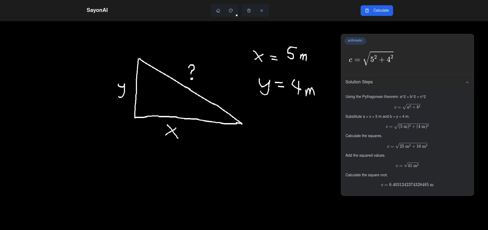

# AI Calculator

<div align="center">


</div>

An intelligent calculator application that can process and solve mathematical expressions from images using AI. This application combines modern web technologies with artificial intelligence to provide a seamless experience for solving mathematical problems.

## 📊 Example

<div align="center">
  
  <p><i>Screenshot: AI Calculator interface with handwritten calculation example</i></p>
</div>

## ✨ Features

- ✏️ **Handwriting support** - Works with both handwritten and printed mathematical expressions
- 🧮 **Comprehensive math support** - Handles arithmetic, equations, functions, and variable assignments
- 🧠 **Powered by Gemini AI** - Leverages Google's Gemini 2.0 Flash LLM for intelligent expression analysis
- 🔍 **Step-by-step solutions** - View detailed calculation steps with explanations

## 🛠️ Tech Stack

### Frontend
- **React** + **TypeScript** - Modern frontend framework with type safety
- **Vite** - Next-generation build tool with instant HMR
- **Tailwind CSS** - Utility-first CSS framework
- **KaTeX** - Fast math typesetting library for displaying formulas
- **Lucide** - Beautiful & consistent icons
- **React-Draggable** - Draggable UI components

### Backend
- **FastAPI** - High-performance Python web framework
- **Google Gemini** - Advanced large language model for mathematical analysis
- **Pillow** - Python imaging library for processing uploaded images
- **Python 3.8+** - Modern Python with async support

## 📋 Prerequisites

Before you begin, ensure you have the following installed:
- **Node.js** (v16 or higher)
- **Python** (v3.8 or higher)
- **pip** (Python package manager)
- **Git**
- **Google Cloud API key** for Gemini LLM (with access to Gemini 2.0 Flash model)

## 🚀 Installation

### Backend Setup

1. Clone the repository and navigate to the backend directory:
```bash
git clone https://github.com/yourusername/ai-calculator.git
cd ai-calculator/calc-be
```

2. Create a virtual environment (recommended):
```bash
python -m venv venv
source venv/bin/activate  # On Windows, use: venv\Scripts\activate
```

3. Install dependencies:
```bash
pip install -r requirements.txt
```

4. Create a `.env` file in the `calc-be` directory with the following content:
```bash
GEMINI_API_KEY=your_gemini_api_key_here
```
Replace `your_gemini_api_key_here` with your actual Google Cloud API key for Gemini LLM.

### Frontend Setup

1. Navigate to the frontend directory:
```bash
cd ../calc-fe
```

2. Install dependencies:
```bash
npm install
```

3. Create a `.env` file with the backend URL:
```bash
VITE_API_URL=http://localhost:8000
```

## 🏃‍♀️ Running the Application

### Start the Backend Server

1. From the `calc-be` directory with your virtual environment activated:
```bash
python main.py
```
The backend server will start at `http://localhost:8900`

### Start the Frontend Development Server

1. From the `calc-fe` directory:
```bash
npm run dev
```
The frontend development server will start at `http://localhost:5173`

## 🎮 Usage Guide

1. Open your web browser and navigate to `http://localhost:5173`
2. Use the drawing canvas to write or draw a mathematical expression
3. Click the "Calculate" button to process the expression
4. View the result card with the solution and explanation
5. Click the "Steps" dropdown to see detailed step-by-step calculations
6. Use the eraser tool to correct mistakes or the reset button to clear everything

### Supported Mathematical Operations

- **Arithmetic**: Addition, subtraction, multiplication, division, exponentiation
- **Equations**: Linear and quadratic equation solving
- **Functions**: Trigonometric, logarithmic, and other common mathematical functions
- **Variable assignments**: Define and use variables in calculations

## 🔌 API Endpoints

### `POST /calculate`
- **Purpose**: Process mathematical expressions from images
- **Request body**:
  ```json
  {
    "image": "base64_encoded_image_data",
    "dict_of_vars": {"x": 5, "y": 10}  // Optional variable definitions
  }
  ```
- **Response**:
  ```json
  {
    "message": "Image processed successfully",
    "data": [
      {
        "expr": "2 + 2",
        "result": "4",
        "steps": [...],
        "type": "arithmetic",
        "assign": false,
        "latex": "2 + 2 = 4"
      }
    ],
    "status": "success"
  }
  ```

### `GET /`
- **Purpose**: Health check endpoint
- **Response**: Server status information

## ❓ Troubleshooting

### Common Issues

1. **Invalid API Key Error**:
   - Ensure your Gemini API key is correctly set in the `.env` file
   - Verify that your API key has access to the Gemini 2.0 Flash model

2. **Image Processing Error**:
   - Try using clearer handwriting
   - Ensure good lighting and contrast in the image
   - Use simpler expressions first to test functionality

3. **CORS Issues**:
   - Make sure the frontend is accessing the correct backend URL
   - Check that the backend CORS settings allow your frontend origin

### Getting Help

If you encounter issues not covered here, please:
1. Check the console logs in your browser and terminal for error messages
2. Refer to the [Google Gemini API documentation](https://ai.google.dev/docs/gemini_api_overview)
3. Open an issue in the GitHub repository with detailed reproduction steps

## 🤝 Contributing

1. Fork the repository
2. Create your feature branch (`git checkout -b feature/AmazingFeature`)
3. Commit your changes (`git commit -m 'Add some AmazingFeature'`)
4. Push to the branch (`git push origin feature/AmazingFeature`)
5. Open a Pull Request

## 📜 License

This project is licensed under the MIT License - see the LICENSE file for details.

## 🙏 Acknowledgments

- Google Gemini team for providing the powerful LLM capabilities
- The open-source community for the amazing libraries and tools that make this possible 